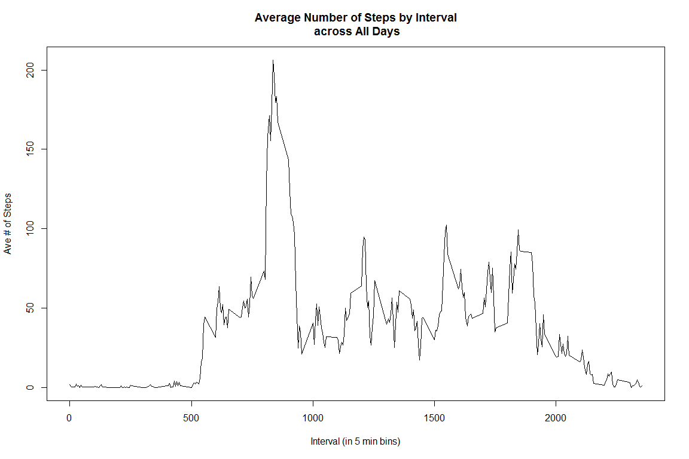

# #Reproducible Research Peer Assessment 1
SV  

Assumptions:

1.  unzipped data file is located in current working directory

2.  packages installed:  ggplot2, dplyr

===========================================================

Set global options and path for figures:


```r
knitr::opts_chunk$set(fig.width=12, fig.height=8, fig.path='figs/')
```

============================================================

#Part 1: Load and process the data for analysis.

1.  Load using read.csv

2.  Convert date to "date" type

3.  head() gives a peak at the data


```r
am_data<-read.csv("activity.csv")
am_data$date<-as.Date(am_data$date)

head(am_data)
```

```
##   steps       date interval
## 1    NA 2012-10-01        0
## 2    NA 2012-10-01        5
## 3    NA 2012-10-01       10
## 4    NA 2012-10-01       15
## 5    NA 2012-10-01       20
## 6    NA 2012-10-01       25
```

-----------------------------------------------------------

#Part 2: What is the mean total number of steps taken per day?

*For this part of the assignment, you can ignore the missing values in the dataset.*

1. Calculate the total number of steps taken per day


```r
library(dplyr)
```

```
## Warning: package 'dplyr' was built under R version 3.2.2
```

```
## 
## Attaching package: 'dplyr'
## 
## The following objects are masked from 'package:stats':
## 
##     filter, lag
## 
## The following objects are masked from 'package:base':
## 
##     intersect, setdiff, setequal, union
```

```r
by_date<-group_by(am_data,date)
tot_steps<-summarise(by_date,sum(steps, na.rm=TRUE))
names(tot_steps)[2]<-"steps"
head(tot_steps)
```

```
## Source: local data frame [6 x 2]
## 
##         date steps
##       (date) (int)
## 1 2012-10-01     0
## 2 2012-10-02   126
## 3 2012-10-03 11352
## 4 2012-10-04 12116
## 5 2012-10-05 13294
## 6 2012-10-06 15420
```


2. Make a histogram of the total number of steps taken each day


```r
steps_hist<-hist(tot_steps$steps,breaks=16,main="Histogram: Total Steps per Day", xlab="Daily Steps", col="green")
```

 

```r
steps_hist
```

```
## $breaks
##  [1]     0  1000  2000  3000  4000  5000  6000  7000  8000  9000 10000
## [12] 11000 12000 13000 14000 15000 16000 17000 18000 19000 20000 21000
## [23] 22000
## 
## $counts
##  [1] 10  0  1  1  1  2  1  2  5  2 10  6  6  4  2  5  0  1  0  0  1  1
## 
## $density
##  [1] 1.639344e-04 0.000000e+00 1.639344e-05 1.639344e-05 1.639344e-05
##  [6] 3.278689e-05 1.639344e-05 3.278689e-05 8.196721e-05 3.278689e-05
## [11] 1.639344e-04 9.836066e-05 9.836066e-05 6.557377e-05 3.278689e-05
## [16] 8.196721e-05 0.000000e+00 1.639344e-05 0.000000e+00 0.000000e+00
## [21] 1.639344e-05 1.639344e-05
## 
## $mids
##  [1]   500  1500  2500  3500  4500  5500  6500  7500  8500  9500 10500
## [12] 11500 12500 13500 14500 15500 16500 17500 18500 19500 20500 21500
## 
## $xname
## [1] "tot_steps$steps"
## 
## $equidist
## [1] TRUE
## 
## attr(,"class")
## [1] "histogram"
```


3. Calculate and report the mean and median of the total number of steps taken per day


```r
mean(tot_steps$steps)
```

```
## [1] 9354.23
```

```r
median(tot_steps$steps)
```

```
## [1] 10395
```

------------------------------------------------------

#Part 3:  What is the average daily activity pattern?

1.  Make a time series plot (i.e. type = "l") of the 5-minute interval (x-axis) and the average number of steps taken, averaged across all days (y-axis)


*Note: 2355 intervals per day*


```r
by_interval<-group_by(am_data,interval)
ave_steps<-summarise(by_interval, mean(steps, na.rm = TRUE))
names(ave_steps)[2]<-"steps"

#Values are low because many entries are zeros

head(ave_steps)
```

```
## Source: local data frame [6 x 2]
## 
##   interval     steps
##      (int)     (dbl)
## 1        0 1.7169811
## 2        5 0.3396226
## 3       10 0.1320755
## 4       15 0.1509434
## 5       20 0.0754717
## 6       25 2.0943396
```

```r
plot(ave_steps$interval, ave_steps$steps, type="l", main="Average Number of Steps by Interval\n across All Days", xlab="Interval (in 5 min bins)", ylab="Ave # of Steps")
```

 

2.  Which 5-minute interval, on average across all the days in the dataset, contains the maximum number of steps?


```r
max_ave<-max(ave_steps$steps)
ave_steps[ave_steps$steps==max_ave,]
```

```
## Source: local data frame [1 x 2]
## 
##   interval    steps
##      (int)    (dbl)
## 1      835 206.1698
```

Interval 835 contains the maximum number of steps, the maximum number of steps in that interval is approximately 206.

---------------------------------

#Part 4:  Imputing missing values

*According to assignment instructions:  Note that there are a number of days/intervals where there are missing values (coded as NA).The presence of missing days may introduce bias into some calculations or summaries of the data.*

1.  Calculate and report the total number of missing values in the dataset 

*(i.e. the total number of rows with NAs)*


```r
sum(is.na(am_data$steps))
```

```
## [1] 2304
```


2.  Devise a strategy for filling in all of the missing values in the dataset. 


    Strategy:  Replace NA's in dataset with mean number of steps for that 
    interval across all days.  These means were calculuated in Part 3.  See 
    implementation in the next step.*


3.  Create a new dataset that is equal to the original dataset but with the 
missing data filled in.


    To do this, first filter the data by separating the rows that contain       NA's from the rows not containing NA's.


    Then, merge the NA-containing data with the data containing the means       for each interval, as calculated previous and stored in ave_steps.  Use     this merged data to replace the NA's with the interval means.  Finally,     recombine the data segments. Arrange this data by date and then by          interval.
am_data2 is the new data set, the equivalent of the origninal dataset with 
the NA's replaced by the interval means.*


```r
filt_data<-filter(am_data,!is.na(am_data$steps))
filt_data2<-filter(am_data,is.na(am_data$steps))

m<-merge(x=filt_data2,y=ave_steps, by="interval")

filt_data2$steps<-m$steps.y

am_data2<-rbind(filt_data,filt_data2)
am_data2<-arrange(am_data2,date,interval)

head(am_data2)
```

```
##      steps       date interval
## 1 1.716981 2012-10-01        0
## 2 1.716981 2012-10-01        5
## 3 1.716981 2012-10-01       10
## 4 1.716981 2012-10-01       15
## 5 1.716981 2012-10-01       20
## 6 1.716981 2012-10-01       25
```


4.  Make a histogram of the total number of steps taken each day and 


```r
by_date2<-group_by(am_data2,date)
tot_steps2<-summarise(by_date2,sum(steps, na.rm=TRUE))
names(tot_steps2)[2]<-"steps"

steps_hist2<-hist(tot_steps2$steps,breaks=16,main="Histogram: Total Steps per Day\n NA's Replaced by Interval Means", xlab="Daily Steps", col="green")
```

 

```r
steps_hist2
```

```
## $breaks
##  [1]     0  2000  4000  6000  8000 10000 12000 14000 16000 18000 20000
## [12] 22000 24000 26000
## 
## $counts
##  [1]  5  2  3  3  7 16 12  8  2  0  2  0  1
## 
## $density
##  [1] 4.098361e-05 1.639344e-05 2.459016e-05 2.459016e-05 5.737705e-05
##  [6] 1.311475e-04 9.836066e-05 6.557377e-05 1.639344e-05 0.000000e+00
## [11] 1.639344e-05 0.000000e+00 8.196721e-06
## 
## $mids
##  [1]  1000  3000  5000  7000  9000 11000 13000 15000 17000 19000 21000
## [12] 23000 25000
## 
## $xname
## [1] "tot_steps2$steps"
## 
## $equidist
## [1] TRUE
## 
## attr(,"class")
## [1] "histogram"
```


5.  Calculate and report the mean and median total number of steps taken per day. 


```r
#These are for the modified dataset.
mean(tot_steps2$steps)
```

```
## [1] 10766.19
```

```r
median(tot_steps2$steps)
```

```
## [1] 11015
```

```r
#These are for the original dataset.
mean(tot_steps$steps)
```

```
## [1] 9354.23
```

```r
median(tot_steps$steps)
```

```
## [1] 10395
```


6.  Do these values differ from the estimates from the first part of the 
assignment? What is the impact of imputing missing data on the estimates of 
the total daily number of steps?


  Yes, the mean and median of the modified data are both greather than those
  of the original data.  By replacing the "NA's" with estimates based on the
  means for each interval, the total number of steps taken on any given day 
  that had "NA's" will increase.  Therefore, the mean across all days will 
  increase.  Likewise, the median.


----------------------------------------------------------------------


#Part 5:  Are there differences in activity patterns between weekdays and weekends?

  *Use the dataset with the filled-in missing values for this part.*


1.  Create a new factor variable in the dataset with two levels - "weekday" 
and "weekend" indicating whether a given date is a weekday or weekend day.


  *Note: Questions 1 & 2 are coded together here.*


  -First, the day of the week is derived from the date and added as a new 
  column to the data.Then the data is filtered into a "weekend" set and a 
  "weekday" set.  A new column is appended to each set labeling the days as 
  "weeknd" or "weekday".  Then the data is recombined into a single dataset 
  called wk_data.


  -Next, the mean steps per interval are computed as previously, but this      time the data is grouped by interval and by day_type (weekend or weekday).


  -The "day_type" is recast as a factor.


```r
weekday_data<-mutate(am_data2,day=weekdays(date))
wkend<-filter(weekday_data,day=="Saturday"|day=="Sunday")
wkday<-filter(weekday_data,!day=="Saturday"&!day=="Sunday")
wkend<-mutate(wkend,day_type="Weekend")
wkday<-mutate(wkday,day_type="Weekday")

wk_data<-rbind(wkend,wkday)
wk_data<-arrange(wk_data,date,interval)


by_interval2<-group_by(wk_data,interval,day_type)
ave_steps2<-summarise(by_interval2, mean(steps, na.rm = TRUE))
names(ave_steps2)[3]<-"steps"
head(ave_steps2)
```

```
## Source: local data frame [6 x 3]
## Groups: interval [3]
## 
##   interval day_type     steps
##      (int)    (chr)     (dbl)
## 1        0  Weekday  5.437736
## 2        0  Weekend 10.841981
## 3        5  Weekday  3.815514
## 4        5  Weekend 10.841981
## 5       10  Weekday  3.571069
## 6       10  Weekend 10.841981
```

```r
ave_steps2$day_type<-as.factor(ave_steps2$day_type)
```


2.  Make a panel plot containing a time series plot (i.e. type = "l") 
of the 5-minute interval (x-axis) and the average number of steps taken, 
averaged across all weekday days or weekend days (y-axis). 


  *See the README file in the GitHub repository to see an example of what     this plot should look like using simulated data.*


  The ggplot2 package is used for this.  The facets parameter is used to 
  generate plots for "Weekend" and "Weekday".


```r
library(ggplot2)
```

```
## Warning: package 'ggplot2' was built under R version 3.2.2
```

```r
p<-qplot(x=interval,y=steps, data=ave_steps2, geom="line", facet=~day_type, ylab="Number of Steps")

p+facet_wrap(~day_type,nrow=2)
```

 


